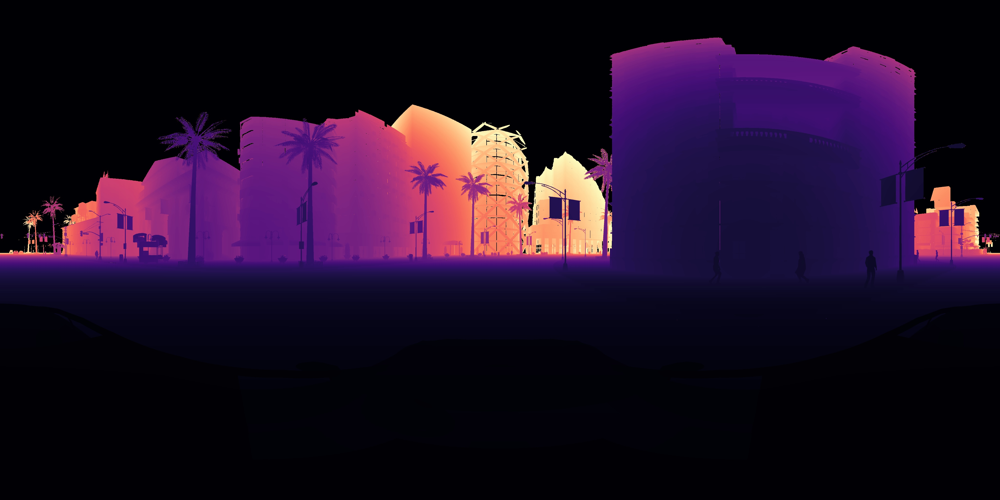
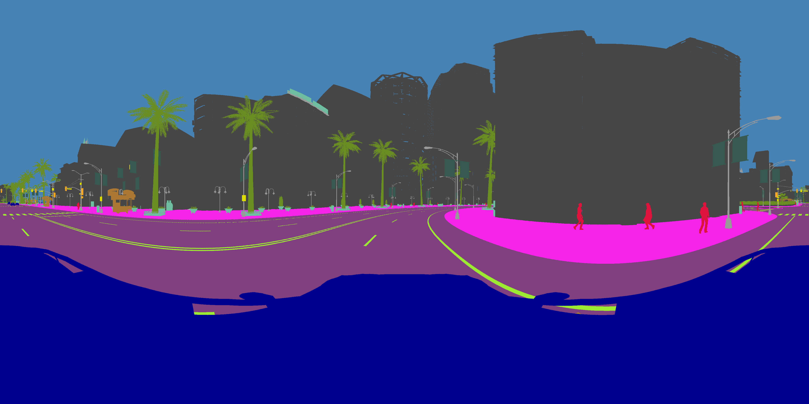
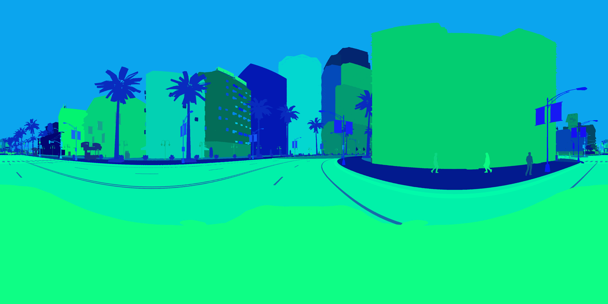

# CARLA_MV_RIG
A multi view rig in CARLA to record 360° sequences for color cameras, instance segmentation and depth estimation.

## Setup
1. Install CARLA 9.14 via Docker
```bash
docker pull carlasim/carla:0.9.14
```
See https://carla.readthedocs.io/en/latest/build_docker/ for more details

2. Install the CARLA Python API
See https://carla.readthedocs.io/en/0.9.14/start_quickstart/ for more details

## Recording
For a simple recording run:
```bash
python multi_camera_rig.py
```
We enable various options for simulation as args. This includes the map used, the weather, the traffic composition, the sensor placement, and many more options.
Make sure to set a valid save_path!

## Post Processing
We stitch the panoramas in a postprocessing step.
For the stitching run:
```bash
python Stitch_CARLA_Panorama.py -data_path "path/to/your/recording"
```
The stitching will create an additional folder "equirectangular" which contains the stitched panoramas for RGB, range, semantic segmentation, and instance segmentation.

## Data
The final data is stored in the following folder structure
```bash
├── calib_depth # calibration intrinsics and world2sensor
├── calib_is # calibration intrinsics and world2sensor
├── calib_rgb # calibration intrinsics and world2sensor
├── calib_ss # calibration intrinsics and world2sensor
├── equirectangular # panoramas
│   ├── labels_0000.png # instance
│   ├── labels_*.png
│   ├── prange_0000.jpg # preview range
│   ├── prange_*.jpg
│   ├── range_0000.png # raw range
│   ├── range_*.png
│   ├── rgb_0000.png # rgb
│   ├── rgb_*.png
│   ├── semantic_0000.png # semantic
│   └── semantic_*.png
├── full_ts_camera.txt
├── images_depth # six depth images per time step
├── images_is # six instance images per time step
├── images_rgb # six rgb images per time step
│   ├── 0000_0.png
│   ├── 0000_1.png
│   ├── 0000_2.png
│   ├── 0000_3.png
│   ├── 0000_4.png
│   ├── 0000_5.png
│   ├── 0000_6.png
│   ├── 0009_0.png
│   ├── *_1.png
│   ├── *_2.png
│   ├── *_3.png
│   ├── *_4.png
│   ├── *_5.png
│   └── *_6.png
├── images_ss # six semantic images per time step
│   ├── 0000_10.png
│   ├── 0000_11.png
│   ├── 0000_12.png
│   ├── 0000_13.png
│   ├── 0000_14.png
│   ├── 0000_15.png
│   ├── 0000_16.png
│   ├── *_10.png
│   ├── *_11.png
│   ├── *_12.png
│   ├── *_13.png
│   ├── *_14.png
│   ├── *_15.png
│   └── *_16.png
└── labels # Labels are in world coordinates
    ├── 0000.json
    └── *.json
```
Our panoramas come as uint8 RGB: 

For our range images we use uint16 to store range up to 500m with cm accuracy.
Keep in mind that we use range and not depth!

For the semantic segmentation, we use the classes available in CARLA 9.14 

For the instance segmentation we use the CARLA color coding. The red channel encodes the instance class and the green and blue channel encode the instance id.
See https://carla.readthedocs.io/en/latest/tuto_G_instance_segmentation_sensor/ for more details.


3D annotations come as a json file in world coordinates.
```json
# example for a parked vehicle
"17457127875173060790": {
        "number_of_wheels": 4,
        "motion_state": "static",
        "velocity": [
            0.0,
            0.0,
            0.0
        ],
        "acceleration": [
            0.0,
            0.0,
            0.0
        ],
        "semantic_tag": 14,
        "type_id": "SM_Cybertruck_2547_SM_0",
        "extent": [
            3.1367764472961426,
            1.1947870254516602,
            1.049095630645752
        ],
        "location": [
            -78.6539077758789,
            158.33090209960938,
            1.1551820039749146
        ],
        "rotation": [
            0.0,
            -90.00011444091797,
            0.0
        ]
    },
# example for a dynamic vehicle
"2078": {
        "motion_state": "dynamic",
        "velocity": [
            0.123526930809021,
            -5.13452672958374,
            0.011053771711885929
        ],
        "acceleration": [
            0.14574922621250153,
            -5.442385673522949,
            0.006620883941650391
        ],
        "extent": [
            2.3958897590637207,
            1.081725001335144,
            0.7438300251960754
        ],
        "location": [
            -103.10681268945336,
            -16.414973518848456,
            0.7366712991497479
        ],
        "rotation": [
            0.0778300017118454,
            -88.86638641357422,
            -0.0023193347733467817
        ],
        "semantic_tag": [
            14
        ],
        "type_id": "vehicle.tesla.model3",
        "verts": [
            [
                -104.26436614990234,
                -14.070184707641602,
                -0.010417366400361061
            ],
            [
                -104.26446533203125,
                -14.06816577911377,
                1.4772412776947021
            ],
            [
                -102.10133361816406,
                -14.027382850646973,
                -0.01032979041337967
            ],
            [
                -102.10143280029297,
                -14.02536392211914,
                1.477328896522522
            ],
            [
                -104.16956329345703,
                -18.86102294921875,
                -0.003908263985067606
            ],
            [
                -104.16966247558594,
                -18.8590030670166,
                1.4837504625320435
            ],
            [
                -102.00653839111328,
                -18.818220138549805,
                -0.003820687998086214
            ],
            [
                -102.00663757324219,
                -18.816200256347656,
                1.4838379621505737
            ]
        ]
    },
# example for a walker
"1934": {
        "bones": {
            "crl_root": {
                "world": [
                    108.05079650878906,
                    121.1381607055664,
                    0.18389983475208282
                ]
            },
            "crl_hips__C": {
                "world": [
                    108.05355834960938,
                    121.16062927246094,
                    1.1909080743789673
                ]
            },
            "crl_spine__C": {
                "world": [
                    108.0523910522461,
                    121.16585540771484,
                    1.2980563640594482
                ]
            },
            "crl_spine01__C": {
                "world": [
                    108.05001068115234,
                    121.17446899414062,
                    1.4634591341018677
                ]
            },
            "crl_shoulder__L": {
                "world": [
                    108.03545379638672,
                    121.12032318115234,
                    1.6062664985656738
                ]
            },
            "crl_arm__L": {
                "world": [
                    107.92959594726562,
                    121.1008529663086,
                    1.6123591661453247
                ]
            },
            "crl_foreArm__L": {
                "world": [
                    107.83472442626953,
                    121.13662719726562,
                    1.364441156387329
                ]
            },
            "crl_hand__L": {
                "world": [
                    107.83473205566406,
                    121.07318878173828,
                    1.1235071420669556
                ]
            },
            "crl_handThumb__L": {
                "world": [
                    107.85289764404297,
                    121.05223083496094,
                    1.0847876071929932
                ]
            },
            "crl_handThumb01__L": {
                "world": [
                    107.88751983642578,
                    121.04344177246094,
                    1.0651510953903198
                ]
            },
            "crl_handThumb02__L": {
                "world": [
                    107.89883422851562,
                    121.04056549072266,
                    1.0377215147018433
                ]
            },
            "crl_handThumbEnd__L": {
                "world": [
                    107.90818786621094,
                    121.0401840209961,
                    1.0114282369613647
                ]
            },
            "crl_handIndex__L": {
                "world": [
                    107.84544372558594,
                    121.02650451660156,
                    1.038881540298462
                ]
            },
            "crl_handIndex01__L": {
                "world": [
                    107.86197662353516,
                    121.0208740234375,
                    0.995806872844696
                ]
            },
            "crl_handIndex02__L": {
                "world": [
                    107.88565063476562,
                    121.03314208984375,
                    0.9777752757072449
                ]
            },
            "crl_handIndexEnd__L": {
                "world": [
                    107.90214538574219,
                    121.04653930664062,
                    0.9751145243644714
                ]
            },
            "crl_handMiddle__L": {
                "world": [
                    107.82324981689453,
                    121.0408935546875,
                    1.0337742567062378
                ]
            },
            "crl_handMiddle01__L": {
                "world": [
                    107.84420776367188,
                    121.04159545898438,
                    0.9913702011108398
                ]
            },
            "crl_handMiddle02__L": {
                "world": [
                    107.86672973632812,
                    121.05128479003906,
                    0.9749568104743958
                ]
            },
            "crl_handMiddleEnd__L": {
                "world": [
                    107.89038848876953,
                    121.06623077392578,
                    0.9685587286949158
                ]
            },
            "crl_handRing__L": {
                "world": [
                    107.81593322753906,
                    121.06014251708984,
                    1.0292448997497559
                ]
            },
            "crl_handRing01__L": {
                "world": [
                    107.83677673339844,
                    121.06705474853516,
                    0.9954981803894043
                ]
            },
            "crl_handRing02__L": {
                "world": [
                    107.86127471923828,
                    121.07935333251953,
                    0.9828935861587524
                ]
            },
            "crl_handRingEnd__L": {
                "world": [
                    107.88993835449219,
                    121.09441375732422,
                    0.987077534198761
                ]
            },
            "crl_handPinky__L": {
                "world": [
                    107.81275939941406,
                    121.0829849243164,
                    1.0312632322311401
                ]
            },
            "crl_handPinky01__L": {
                "world": [
                    107.82990264892578,
                    121.08985900878906,
                    1.0093401670455933
                ]
            },
            "crl_handPinky02__L": {
                "world": [
                    107.84795379638672,
                    121.09906768798828,
                    0.9988117218017578
                ]
            },
            "crl_handPinkyEnd__L": {
                "world": [
                    107.87003326416016,
                    121.10770416259766,
                    0.9981173276901245
                ]
            },
            "crl_neck__C": {
                "world": [
                    108.07022094726562,
                    121.14060974121094,
                    1.655021071434021
                ]
            },
            "crl_Head__C": {
                "world": [
                    108.0844497680664,
                    121.10606384277344,
                    1.741153359413147
                ]
            },
            "crl_eye__L": {
                "world": [
                    108.08818054199219,
                    121.0182876586914,
                    1.8243180513381958
                ]
            },
            "crl_eye__R": {
                "world": [
                    108.14533233642578,
                    121.03910827636719,
                    1.8224716186523438
                ]
            },
            "crl_shoulder__R": {
                "world": [
                    108.10906982421875,
                    121.1532974243164,
                    1.60500967502594
                ]
            },
            "crl_arm__R": {
                "world": [
                    108.19503784179688,
                    121.22017669677734,
                    1.614478588104248
                ]
            },
            "crl_foreArm__R": {
                "world": [
                    108.29930114746094,
                    121.21471405029297,
                    1.365910291671753
                ]
            },
            "crl_hand__R": {
                "world": [
                    108.39306640625,
                    121.07955169677734,
                    1.1787916421890259
                ]
            },
            "crl_handThumb__R": {
                "world": [
                    108.39817810058594,
                    121.04145050048828,
                    1.1544032096862793
                ]
            },
            "crl_handThumb01__R": {
                "world": [
                    108.38609313964844,
                    121.00440979003906,
                    1.1424351930618286
                ]
            },
            "crl_handThumb02__R": {
                "world": [
                    108.38997650146484,
                    120.98439025878906,
                    1.1206810474395752
                ]
            },
            "crl_handThumbEnd__R": {
                "world": [
                    108.393798828125,
                    120.96761322021484,
                    1.0987070798873901
                ]
            },
            "crl_handIndex__R": {
                "world": [
                    108.4288558959961,
                    121.01175689697266,
                    1.1227362155914307
                ]
            },
            "crl_handIndex01__R": {
                "world": [
                    108.4426040649414,
                    120.9862060546875,
                    1.0864289999008179
                ]
            },
            "crl_handIndex02__R": {
                "world": [
                    108.44049835205078,
                    120.970947265625,
                    1.0581656694412231
                ]
            },
            "crl_handIndexEnd__R": {
                "world": [
                    108.43464660644531,
                    120.96259307861328,
                    1.0393401384353638
                ]
            },
            "crl_handMiddle__R": {
                "world": [
                    108.43961334228516,
                    121.03378295898438,
                    1.1115779876708984
                ]
            },
            "crl_handMiddle01__R": {
                "world": [
                    108.44458770751953,
                    121.01020050048828,
                    1.0708787441253662
                ]
            },
            "crl_handMiddle02__R": {
                "world": [
                    108.43636322021484,
                    120.9957504272461,
                    1.0465049743652344
                ]
            },
            "crl_handMiddleEnd__R": {
                "world": [
                    108.42298889160156,
                    120.98291778564453,
                    1.0263034105300903
                ]
            },
            "crl_handRing__R": {
                "world": [
                    108.4356689453125,
                    121.05054473876953,
                    1.0994025468826294
                ]
            },
            "crl_handRing01__R": {
                "world": [
                    108.43482208251953,
                    121.0350570678711,
                    1.0622544288635254
                ]
            },
            "crl_handRing02__R": {
                "world": [
                    108.42149353027344,
                    121.02272033691406,
                    1.0381500720977783
                ]
            },
            "crl_handRingEnd__R": {
                "world": [
                    108.40579223632812,
                    121.01327514648438,
                    1.0203372240066528
                ]
            },
            "crl_handPinky__R": {
                "world": [
                    108.4249496459961,
                    121.06961822509766,
                    1.0918668508529663
                ]
            },
            "crl_handPinky01__R": {
                "world": [
                    108.4197998046875,
                    121.05890655517578,
                    1.0657912492752075
                ]
            },
            "crl_handPinky02__R": {
                "world": [
                    108.40874481201172,
                    121.05058288574219,
                    1.0476149320602417
                ]
            },
            "crl_handPinkyEnd__R": {
                "world": [
                    108.3988037109375,
                    121.0427017211914,
                    1.0365772247314453
                ]
            },
            "crl_thigh__R": {
                "world": [
                    108.11619567871094,
                    121.21376037597656,
                    1.1049189567565918
                ]
            },
            "crl_leg__R": {
                "world": [
                    108.10675811767578,
                    121.15249633789062,
                    0.6462110877037048
                ]
            },
            "crl_foot__R": {
                "world": [
                    107.98585510253906,
                    121.31612396240234,
                    0.26157140731811523
                ]
            },
            "crl_toe__R": {
                "world": [
                    108.0421371459961,
                    121.22553253173828,
                    0.21975933015346527
                ]
            },
            "crl_toeEnd__R": {
                "world": [
                    108.06851196289062,
                    121.18905639648438,
                    0.2121610939502716
                ]
            },
            "crl_thigh__L": {
                "world": [
                    107.97382354736328,
                    121.14482116699219,
                    1.104124903678894
                ]
            },
            "crl_leg__L": {
                "world": [
                    108.07833862304688,
                    120.9176025390625,
                    0.7147778868675232
                ]
            },
            "crl_foot__L": {
                "world": [
                    107.96307373046875,
                    121.16767120361328,
                    0.3778553009033203
                ]
            },
            "crl_toe__L": {
                "world": [
                    107.96827697753906,
                    121.09671783447266,
                    0.2880854606628418
                ]
            },
            "crl_toeEnd__L": {
                "world": [
                    107.96981048583984,
                    121.05870819091797,
                    0.26283034682273865
                ]
            }
        },
        "motion_state": "dynamic",
        "velocity": [
            0.748828113079071,
            -1.5261718034744263,
            0.0
        ],
        "acceleration": [
            0.0,
            0.0,
            0.0
        ],
        "extent": [
            0.18767888844013214,
            0.18767888844013214,
            0.9300000071525574
        ],
        "location": [
            108.05079650878906,
            121.1381607055664,
            1.1038998365402222
        ],
        "rotation": [
            0.0,
            -63.87337112426758,
            0.0
        ],
        "semantic_tag": [
            12
        ],
        "type_id": "walker.pedestrian.0022",
        "verts": [
            [
                107.79965209960938,
                121.22401428222656,
                0.1738998293876648
            ],
            [
                107.79965209960938,
                121.22401428222656,
                2.0338997840881348
            ],
            [
                108.13665008544922,
                121.3893051147461,
                0.1738998293876648
            ],
            [
                108.13665008544922,
                121.3893051147461,
                2.0338997840881348
            ],
            [
                107.9649429321289,
                120.88701629638672,
                0.1738998293876648
            ],
            [
                107.9649429321289,
                120.88701629638672,
                2.0338997840881348
            ],
            [
                108.30194091796875,
                121.05230712890625,
                0.1738998293876648
            ],
            [
                108.30194091796875,
                121.05230712890625,
                2.0338997840881348
            ]
        ]
    }
```

